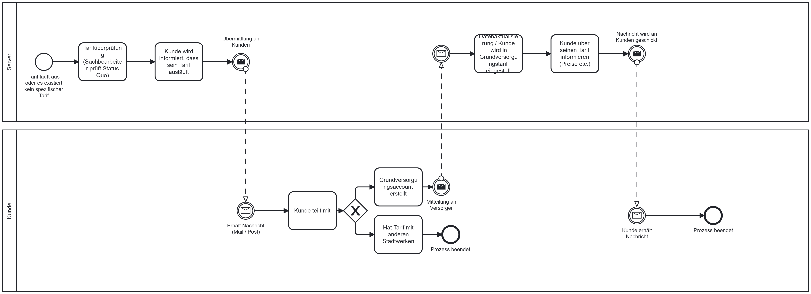
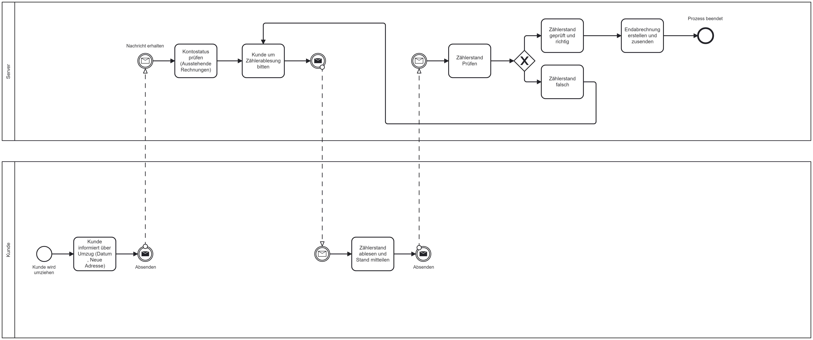
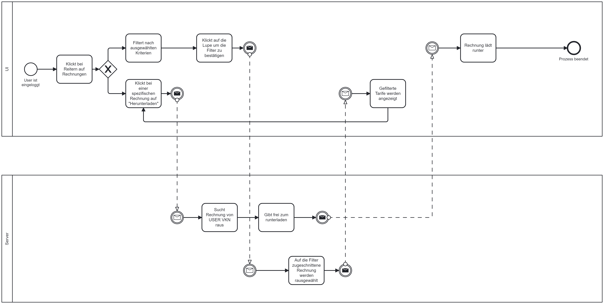
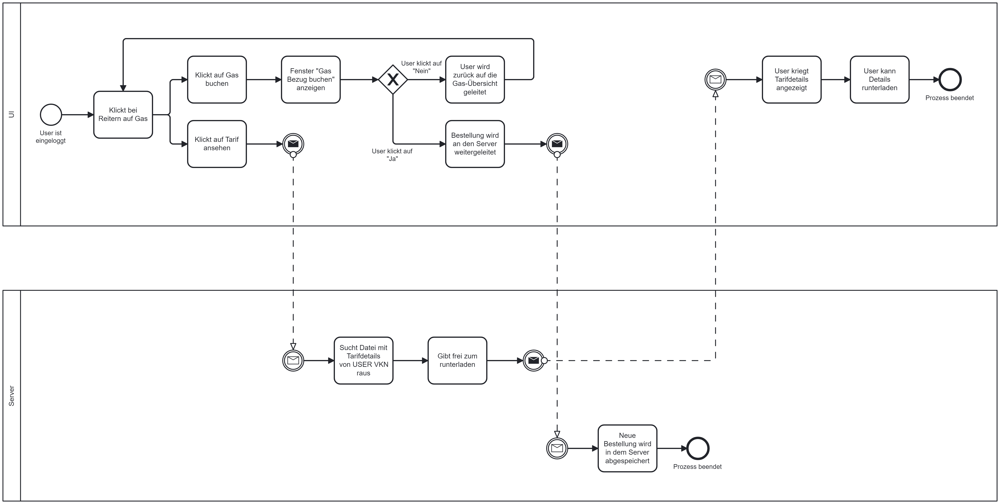

# Modelling

## Application Software

This repository contains BPMN diagrams created for modeling various processes within the context of public utilities. BPMN (Business Process Model and Notation) is a standardized graphical notation for representing business processes, enabling the visualization and analysis of complex workflows. 

### Structure

We display general cases (= GC) such as classification in the basic supply, tariff changes and relocation. We have also created diagrams specially tailored to the user interface (= UI), which describe the login process, processes for customers such as a consumption overview and processes for power users such as customer management.

## Processes

### General cases

#### Classification in basic supply
This process shows the classification of a customer into the basic supply.

#### Tariff changes
This process shows what will happen, if the customer wants to change their tariff.

#### Relocation
This process shows what will happen, if the customer relocates and therefore is no longer a customer of our public utility.

### User Interface

#### Customer: Inital Sign Up
This process is for when the user logs in for the first time ever. In this process users fill in their billing address and select their tariff. A more detailed description follows:

1. Distribution of Initial Access Credentials:
Customers receive their initial access credentials via postal mail to log in for the first time.
2. Add Billing Address:
Customers fill in their billing address through the website for electricity and heating.
3. Tariff Selection:
Customers can choose from a variety of tariffs that meet their needs.
4. Data Storage:
Secure storage of customer data after successful registration.
5. Redirect to Home Screen:
After logging in, customers are redirected to the regular home screen of the website.

#### Customer: Invoice
This process gives the user an overview of all their invoices. They can filter their invoices by date and utilities.

#### Customer: Tariff details gas
This process gives the user a closer look at their gas consumption and they have the possibility to view their tariff and change their gas tariff.

#### Customer: Tariff details heat pump
This process gives the user a closer look at their gas consumption but with a heat pump and they have the possibility to view their tariff and change their heat pump tariff.

#### Customer: Tariff details water
This process gives the user a closer look at their water consumption and they have the possibility to view their tariff and change their water tariff.

#### Customer: Tariff details electricity
This process gives the user a closer look at their electrictiy consumption and they have the possibility to view their tariff and change their electrictiy tariff.

#### Poweruser: Tariff details gas
We modeled this process exemplary for gas, since it is the same process for every segment. This process gives the poweruser a closer look at all tariffs relating to gas. Poweruser can change, add and delete the documents.

#### Poweruser: Customer management
This process gives the poweruser an overview of all customers and their tariffs. Instead of filtering through the segments, the individual customer's tariffs are in the focus. Powerusers can change, add and delete the documents.

