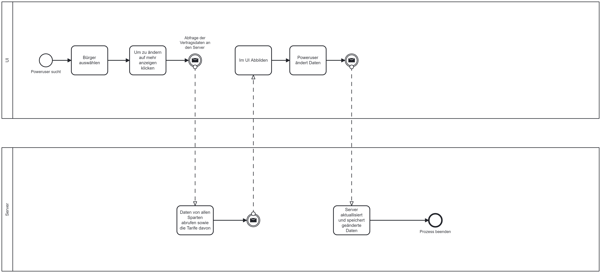

# Modelling
import os

# List files in the current directory
print(os.listdir())
## Application Software

This repository contains BPMN diagrams created for modeling various processes within the context of public utilities. BPMN (Business Process Model and Notation) is a standardized graphical notation for representing business processes, enabling the visualization and analysis of complex workflows. 

### Structure

We display general cases (= GC) such as classification in the basic supply, tariff changes and relocation. We have also created diagrams specially tailored to the user interface (= UI), which describe the login process, processes for customers such as a consumption overview and processes for power users such as customer management.

## Processes

### General cases

#### Classification in basic supply

#### Tariff changes

#### Relocation

### User Interface

#### Customer: Inital Sign Up

#### Customer: Login process

#### Customer: Invoice

#### Customer: Tariff details gas

#### Customer: Tariff details water

#### Customer: Tariff details electrictiy

#### Poweruser: Tariff details gas

#### Poweruser: Customer management

## Getting Started

To view or modify the BPMN models, follow these steps:

1. **Open Editor**: Use a BPMN modeling tool such as Camunda Modeler or Signavio.
2. **Open File**: Open the respective BPMN file (`*.bpmn`) from this directory in the BPMN modeling tool.
3. **Modify Models**: Modify the BPMN models as needed to reflect any changes or updates to the business processes.

## Contributing

1. **Clone Repository**: Clone the repository to your local machine.
2. **Modify BPMN Models**: Make modifications or additions to the BPMN models using a BPMN modeling tool.
3. **Commit Changes**: Commit the changes to your local repository.
4. **Create Pull Request**: Create a pull request to merge the changes into the main branch of the repository.

## Contact

If you have any questions or need assistance, please contact @baghdadbaecker or @TrustedSamu

