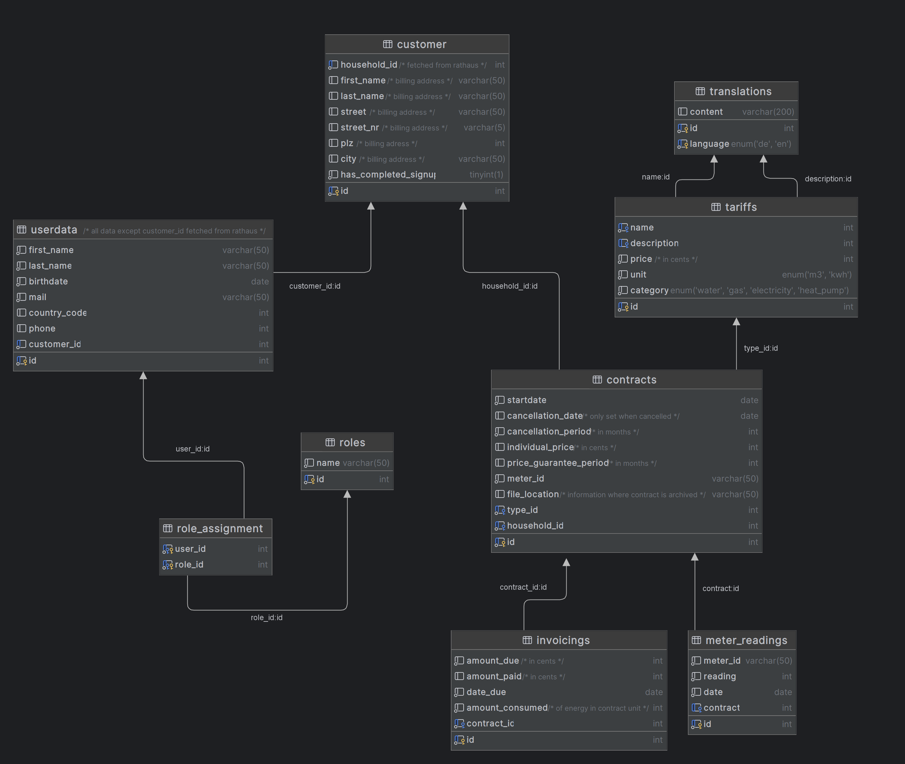

# Modelling

## Database design

The following EER diagram displays the databased design with tables for the *stadtwerke* software.  
It is important to note that this diagram is showing an ideal case where user data, including household information can be fetched via a secure api from the rathaus group:

The diagram can also be generated from plantUML code:    
[db_structure.plantuml](db_structure.plantuml)