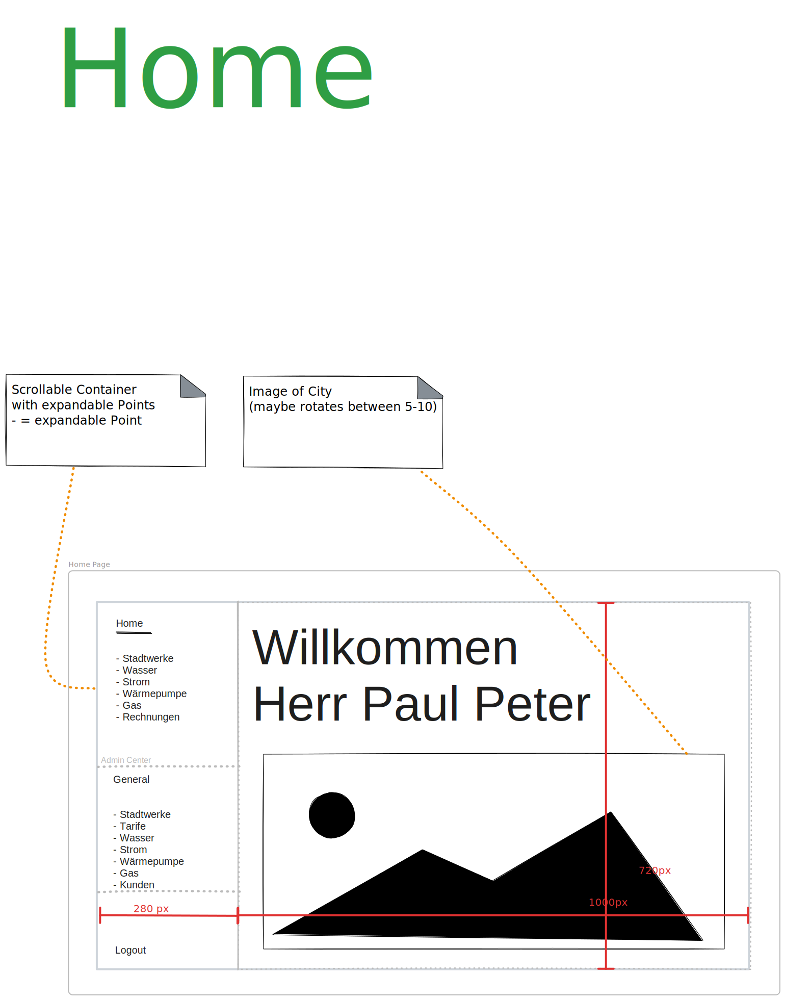

# User Interface (UI) for Bad Walden Stadtwerke

This directory contains all the user interface design for the utility service management software for the city of Bad Walden.

## Structure

The UI is structured into several Pages, each with multiple states.
For each page, the top frame is the initial state when the page is loaded. Below the top frame, there are several states that the page can be in. The states are triggered by user interaction, such as clicking a button or selecting an option from a dropdown menu. On the left is a sidebar to choose the page the user wants to go to. In the UI the sidebar is always the same, but when in use it depends on whether the user is a "Bürger" or a "Poweruser". The top part is for the "Bürger" user and the part at the bottom is for the "Powerusers".

### Basic Design

#### Layout

The general layout of the pages is 1000 x 720px. The sidebar has a 280px width. You can see an example here:

#### Color Scheme

We decided to keep the colors minimalistic. The UI is mainly in black and white. There are some exceptions where we used colors to highlight something. Grey buttons mean, that they cannot be used to prevent the user from using them when we don't want them to. For example, when not every field is filled in.
Red arrows show to which page or state the user interaction leads to. There might be notes next to the arrows. These are conditions. Orange lines lead to further notes about the page or state.

---

### Pages

#### Login

##### First Login - What we implemented.

When logging in for the first time, the user has to enter some information and choose their tariffs first. 
Here is an overview over the pages which we implemented in German and in English:

After the Welcome Page and choosing a language, the user can input their data: Name, Street, House Number, City and Postal Code. If every field is filled in, the button will be activated so that the user can go on. Before going to the next page, the business logic checks that the information is valid. 

Then, the user can choose their tariffs. First, the "Stromtarif" where the user can choose a tariff or choose to not buy electricity from the utility service of Bad Walden:

After that, the user can choose a "Heiztarif", starting with a selection of "Andere" (user does not want to buy from utility service of Bad Walden), "Gas" or "Wärmepumpe":

As water is the basic tariff that every citizen has to have, they cannot choose this tariff. Therefore, there is only the ending page left:

##### Login Page

The Login Page can be used to login into the account. By typing in the correct username and password the user will be led to the Home Page.

#### Buerger

##### Home

The Home page is the first page the user sees after logging in.

##### Stadtwerke

Then, there is an overview for the user over their consumption and costs.

##### Wasser

This page gives the user a closer look at their water consumption and they have the possibility to view their contract and change their water tariff.

##### Strom

This page gives the user a closer look at their electricity consumption and they have the possibility to view their contract and change their electricity tariff or terminate their electricity contract.

##### Gas
This page gives the user a closer look at their electricity consumption and they have the possibility to view their contract and change their electricity tariff or terminate their gas contract.

##### Wärmepumpe

This page gives the user a closer look at their heating pump consumption and they have the possibility to view their contract and change their heating pump tariff or terminate their heating pump contract.

##### Rechnungen

On this page, the user can view their past bills.

---

#### Poweruser

The poweruser is the an employee of the utility service of Bad Walden. Only they can enter the following pages.

##### Wasser

On this page, the user can view, edit and add the water tariffs.

##### Strom

On this page, the user can view, edit and add the electricity tariffs.

##### Gas

On this page, the user can view, edit and add the gas tariffs.

##### Wärmepumpe

On this page, the user can view, edit and add the heating pump tariffs.

##### Kunden

On this page, the user can search and view customers and their tariffs. The user can also edit the tariffs of the customers.

